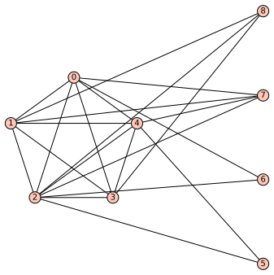

# faster-max-cut
This repository contains an implementation of a faster exact algorithm for the maximum cut problem on split graphs, located under `src/faster_maxcut.py`.

## Example
Here's how to generate and visualize an example of a split graph:

```python
from src.faster_maxcut import *
from sage.misc.randstate import set_random_seed

set_random_seed(1)

k = 5 # size of a clique C
s = 4 # size of an independent set I

g = get_split_graph(k, s) # generates a random connected split graph
g.plot("./figures/split-graph-example.svg")
```
Below is an example of a split graph with a clique of size `k = 5` and an independent set of size `s = 4`:



To compare the results of the brute-force algorithm and the faster algorithm:
```python
brute_cut = brute_mc(g)
faster_cut = faster_mc(g)

brute_cut_size = get_cut_size(brute_cut, g.edges)
faster_cut_size = get_cut_size(faster_cut, g.edges)

print('brute_cut  = {}  size = {}'.format(brute_cut,  brute_cut_size))
print('faster_cut = {}  size = {}'.format(faster_cut, faster_cut_size))
# brute_cut  = ({1, 3, 5, 6, 7}, {0, 8, 2, 4})  size = 15
# faster_cut = ({0, 8, 2, 4}, {1, 3, 5, 6, 7})  size = 15
```

## Testing
To ensure the correctness, `src/test.py` compares the results on 100 random split graphs with varying `k` and `s`:
```bash
$ ./src/test.py
.
----------------------------------------------------------------------
Ran 1 test in 36.267s

OK
```

Compatibility: Tested with Python 3.12.3 and SageMath version 10.3.

## Citation
If you find it useful in your work, please cite the corresponding [paper](https://arxiv.org/abs/2405.20599):

```bibtex
@misc{lalovic2024exact,
      title={Exact Algorithms for MaxCut on Split Graphs}, 
      author={Marko Lalovic},
      year={2024},
      eprint={2405.20599},
      archivePrefix={arXiv},
      primaryClass={cs.DS},
      url={https://arxiv.org/abs/2405.20599}, 
}
```

